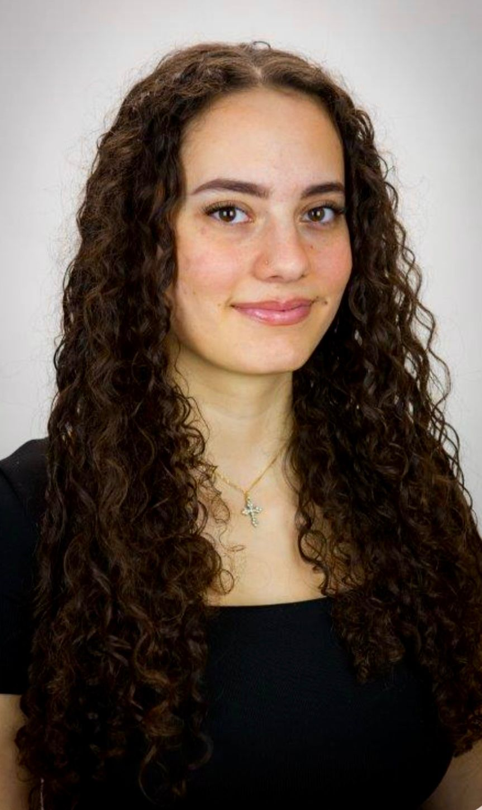

+++
title = "Von Ostern bis Fasten: Giulia Maggiore und die Kunst, zwei Kulturen zu vereinen"
date = "2025-02-28"
draft = false
pinned = false
image = "foto.jpg"
+++


> "Ich erklärte es oft, aber viele glaubten mir nicht. Irgendwann dachte ich mir: Sollen sie doch denken, was sie wollen."

**Zwei Kulturen, zwei Sprachen, zwei Glaubensrichtungen –** Die junge Lehrerin wuchs zwischen italienischen und aramäischen Traditionen auf. In der Schule musste sie sich oft erklären und Vorurteilen begegnen. Heute sieht sie ihre multikulturelle Herkunft als Stärke und erzählt, wie sie gelernt hat, beide Identitäten selbstbewusst zu vereinen.

**Hallo Giulia, danke, dass du dir die Zeit nimmst. Magst du dich kurz vorstellen?**

Hallo, ich bin Giulia Maggiore, zwanzig Jahre alt, Italienerin und Aramäerin.

**Wie würdest du deine kulturelle Identität beschreiben?**

Mein Vater ist Italiener und katholisch. Meine Mutter ist Aramäerin und orthodox, und ich wurde orthodox getauft. Ich fühle mich beiden Kulturen verbunden, aber religiös ist die orthodoxe Seite präsenter.

**Kannst du ein Beispiel dafür nennen?**

Zum Beispiel besuchen wir als Familie immer die orthodoxe Kirche. Mein Vater ist nicht besonders gläubig, also begleitet er uns meistens dorthin, anstatt in eine katholische Kirche zu gehen.

**Wann hast du das letzte Mal bewusst wahrgenommen, dass du zwischen zwei Kulturen aufwächst?**

Sehr oft, besonders bei Feiertagen wie Ostern, das in beiden Traditionen zu unterschiedlichen Zeiten gefeiert wird. Auch auf Hochzeiten ist der Unterschied deutlich: Aramäische Feiern beinhalten traditionelle Tänze und Musik, während italienische Hochzeiten anders ablaufen.

**Wie hat sich dein Alltag als Kind zwischen diesen Kulturen gestaltet? Gab es Unterschiede zwischen zu Hause und der Schule?**

Ich bin mit Italienisch und Aramäisch aufgewachsen. Mein Vater sprach Italienisch mit mir, meine Mutter Aramäisch. In der Schule merkte ich anfangs, dass ich nicht zur deutschsprachigen Kultur gehörte, weil ich kaum Deutsch konnte. Meine Eltern begannen dann, mehr mit mir auf Deutsch zu sprechen, wodurch meine Italienisch- und Aramäisch-Kenntnisse etwas nachliessen.

**Wie bist du mit Vorurteilen umgegangen?**

Manche meinten, Aramäer hätten keine eigene Kultur und hätten alles von den Türken kopiert. Das fand ich unfair, weil unser Volk sehr alt ist.

**Gab es Situationen, in denen du dich zwischen einer Kultur entscheiden musstest?**

Bevor ich einen Freund hatte, dachte ich, es wäre wichtig, einen Aramäer zu heiraten, um die Kultur weiterzugeben. Später wurde mir klar, dass es darauf nicht ankommt.

**Gab es in der Schule Momente, in denen du dich fremd gefühlt hast?**

Ja, besonders, wenn ich erklären musste, was Aramäer sind. Viele wussten nichts darüber und verglichen uns mit anderen Gruppen wie den Kurden. Manche machten sich darüber lustig, aber ich wusste, dass sie es nicht böse meinten.

**Welche Rolle spielt Sprache für deine Identität?**

Eine grosse! Ich liebe Italienisch und bin froh, dass ich die Sprache spreche.

> "Aramäisch ist besonders, weil es die Sprache Jesu war. Die Schrift ist schwierig, da sie aus Zeichen besteht, aber ich habe sie gelernt.“

**Hast du dich je als "anders" empfunden?**

Eigentlich nicht. Ich passe mich beiden Kulturen an, ob in Italien oder in meiner aramäischen Gemeinschaft.

**Welche Werte oder Traditionen waren für dich wichtig?**

Unsere Familie geht jeden Monat in die Kirche, das war von klein auf so. Auch das Fasten ist mir wichtig, aber ich halte mich an die orthodoxen Regeln, nicht an die katholischen.

**Wie sieht das orthodoxe Fasten aus?**

Man isst vegan, mit Ausnahmen wie Fisch und Honig. Vor Ostern dauert das Fasten fast 50 Tage. Es gibt auch kürzere Fastenzeiten vor Weihnachten und Maria Himmelfahrt. Eigentlich soll man jeden Mittwoch und Freitag vegan essen, aber das vergesse ich oft.

**Welche Vorteile siehst du darin, mit zwei Kulturen aufzuwachsen?**

Man lernt früh, andere Kulturen zu akzeptieren. Das hilft später, sei es im Beruf oder im sozialen Leben.

**Gibt es Traditionen, die du bewusst weiterführen willst?**

Ja, die Sprache weiterzugeben ist mir wichtig. Auch aramäische Tänze, Feste und italienische Bräuche wie Panettone zu Weihnachten gehören dazu.

**Hat dein kultureller Hintergrund deine Berufswahl beeinflusst?**

Ja, ich möchte Kindern vermitteln, dass man alle Kulturen akzeptieren soll. Da ich selbst in zwei Kulturen aufgewachsen bin, kann ich das gut nachvollziehen und weitergeben.

**Wie hat sich dein Zugehörigkeitsgefühl über die Jahre verändert?**

Es war immer gleich. Ich habe mich schnell angepasst, sei es in der Familie oder in der Schule.

**Gibt es Werte oder Traditionen, die in Widerspruch standen?**

Nicht wirklich. Einzig das unterschiedliche Osterdatum kann manchmal verwirrend sein. Aber ich habe gelernt, beide Kulturen zu akzeptieren.

**Was hast du für dich aus diesen Erfahrungen mitgenommen?**

Beide Kulturen sind mir wichtig, aber meine orthodoxe Seite ist präsenter. Ich faste nach den orthodoxen Regeln und feiere deren Feiertage bewusster.

**Danke für das spannende Gespräch, Giulia!**

Danke dir!

<!--StartFragment-->



Sie ist 20 Jahre alt und lebt in Lengnau. Zurzeit befindet sie sich in der Ausbildung zur Lehrerin an einer heilpädagogischen Schule. Mit ihrer Entscheidung, diesen Beruf zu ergreifen, möchte sie Kindern mit besonderen Bedürfnissen unterstützen und ihre schulische Entwicklung fördern. In ihrer Ausbildung sammelt sie praktische Erfahrungen, um später als Lehrerin in der Heilpädagogik tätig zu werden.

<!--EndFragment-->



